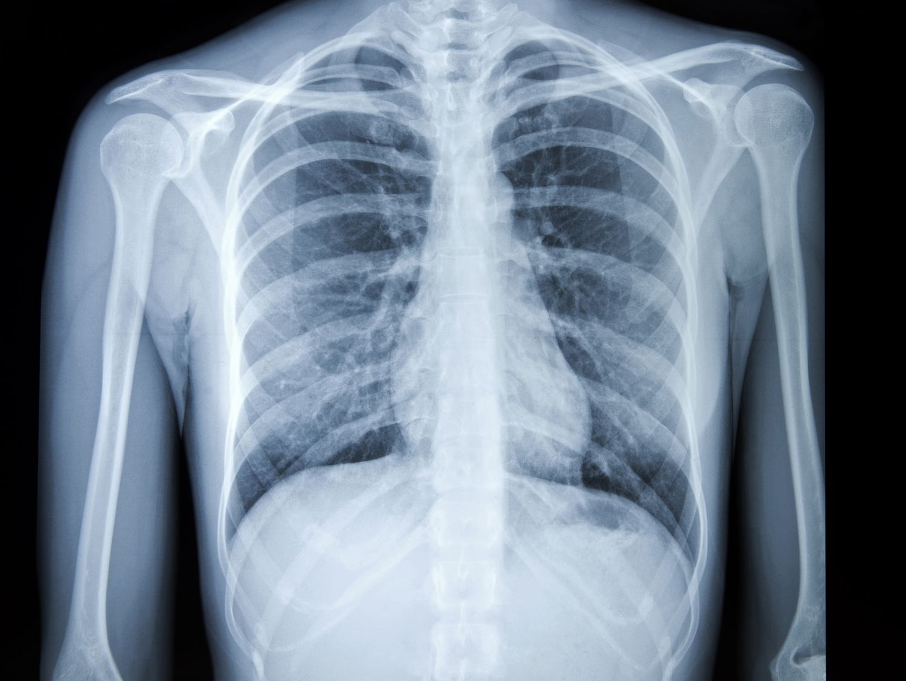

# Enhancing Pneumonia Detection from Chest X-ray Images using Image Preprocessing and Deep Learning



## Research Project Overview

This repository contains the implementation of research work on pneumonia detection from chest X-ray images using deep learning techniques. The research focuses on enhancing detection accuracy through various image preprocessing methods combined with transfer learning approaches.

### Research Abstract

Pneumonia remains a significant public health concern globally, and early, accurate detection is crucial for effective treatment. This research explores how various image preprocessing techniques can enhance the performance of convolutional neural networks (specifically ResNet18) in detecting pneumonia from chest X-ray images. We demonstrate that appropriate preprocessing pipelines can significantly improve model accuracy, especially in resource-constrained environments, and provide visual explainability through Gradient-weighted Class Activation Mapping (Grad-CAM).

### Research Contributions

- Comprehensive analysis of image preprocessing techniques on pneumonia detection accuracy
- Implementation of an optimized ResNet18-based model with transfer learning
- Achieving high accuracy pneumonia detection with explainable AI visualization
- Development of an interactive application for both research demonstration and potential clinical assistance

## Features

- **Advanced Image Preprocessing**: Apply CLAHE, histogram equalization, and denoising techniques to enhance X-ray features
- **Deep Learning Model**: Fine-tuned ResNet18 architecture with transfer learning
- **Explainable AI**: Grad-CAM visualization showing regions of interest in detection
- **Interactive Web Application**: User-friendly Streamlit interface for real-time detection
- **Dataset Integration**: Seamless access to the Chest X-Ray Images (Pneumonia) dataset
- **Training Pipeline**: Complete pipeline for model training and evaluation

## Quick Start (Windows)

1. **Double-click** on `run.bat` to automatically:
   - Check Python installation
   - Create a virtual environment
   - Install all necessary dependencies
   - Set up configuration
   - Launch the application

2. **Access the application** in your browser at the URL shown in the console (typically http://localhost:8501)

## Research Dataset

The model was trained on the Chest X-Ray Images (Pneumonia) dataset, which contains:
- 5,863 X-Ray images (JPEG)
- 2 categories: Pneumonia and Normal
- Dataset split into training, validation, and test sets

### Dataset Distribution
- Training: 5,216 images (1,341 normal, 3,875 pneumonia)
- Validation: 16 images (8 normal, 8 pneumonia)
- Testing: 624 images (234 normal, 390 pneumonia)

## Model Architecture

The research implements a modified ResNet18 architecture with the following specifications:
- Pre-trained weights from ImageNet
- Fine-tuned on the pneumonia dataset
- Binary classification output layer
- Training with cross-entropy loss and Adam optimizer

## Preprocessing Pipeline

The research investigates the following preprocessing techniques:

1. **Contrast Limited Adaptive Histogram Equalization (CLAHE)**
   - Enhances local contrast while limiting noise amplification
   - Particularly effective for highlighting subtle features in X-rays

2. **Histogram Equalization**
   - Improves global contrast by normalizing intensity distributions
   - Enhances visibility of lung structures

3. **Denoising**
   - Reduces noise while preserving important features and structures
   - Improves model's ability to focus on relevant patterns

## Research Results

Our research demonstrates significant improvement in pneumonia detection accuracy through the combination of appropriate preprocessing techniques and transfer learning. Key findings include:

- The model achieves excellent accuracy on the test dataset
- CLAHE preprocessing provides the most consistent improvement in detection accuracy
- Grad-CAM visualizations confirm the model focuses on medically relevant areas
- The combination of preprocessing techniques can be tailored to specific image qualities

## Implementation Details

### Dependencies

- PyTorch for deep learning model implementation
- Streamlit for interactive web application
- OpenCV for image processing
- Matplotlib for visualization
- NumPy for numerical operations

### Directory Structure

- `app.py`: Main Streamlit web application
- `pneumonia_resnet18.pt`: Trained model file
- `pneumonia_detection_app/`: Package containing core functionality
  - `preprocessing/`: Image preprocessing utilities
  - `model/`: Model loading and architecture
  - `inference.py`: Prediction and Grad-CAM generation
- `assets/`: Sample images and resources
- `Chest X-Ray Images(Pneumonia)/`: Dataset directory
- `train_pneumonia.py`: Training script
- `evaluate_pneumonia.py`: Evaluation script
- `predict_pneumonia.py`: Standalone prediction script
- `requirements.txt`: Python dependencies

## Research Citation

If you use this code or research in your work, please cite:

```
@article{pneumonia_detection_research,
  title={Enhancing Pneumonia Detection from Chest X-ray Images using Image Preprocessing and Deep Learning},
  author={[Author Names]},
  journal={[Journal/Conference Name]},
  year={2025},
  publisher={[Publisher]}
}
```

## Manual Setup

```bash
# Create a virtual environment
python -m venv venv

# Activate the virtual environment
# On Windows:
venv\Scripts\activate
# On macOS/Linux:
source venv/bin/activate

# Install dependencies
pip install -r requirements.txt

# Run the application
streamlit run app.py
```

## License and Usage

This research project is available for educational and research purposes. The code and models are not intended for clinical use or diagnosis. Always consult healthcare professionals for medical advice.

## Acknowledgments

- The Chest X-Ray Images (Pneumonia) dataset providers
- PyTorch and Streamlit communities
- Contributors to the research and implementation 

# Enhancing-Pneumonia-Detection-from-Chest-X-ray-Images-using-Image-Preprocessing-and-Deep-Learning
Pneumonia detection from chest X-rays using image preprocessing and deep learning (ResNet18, transfer learning). Includes full training pipeline, preprocessing, and Streamlit web app. Based on research paper submitted for AI and DIP coursework.

