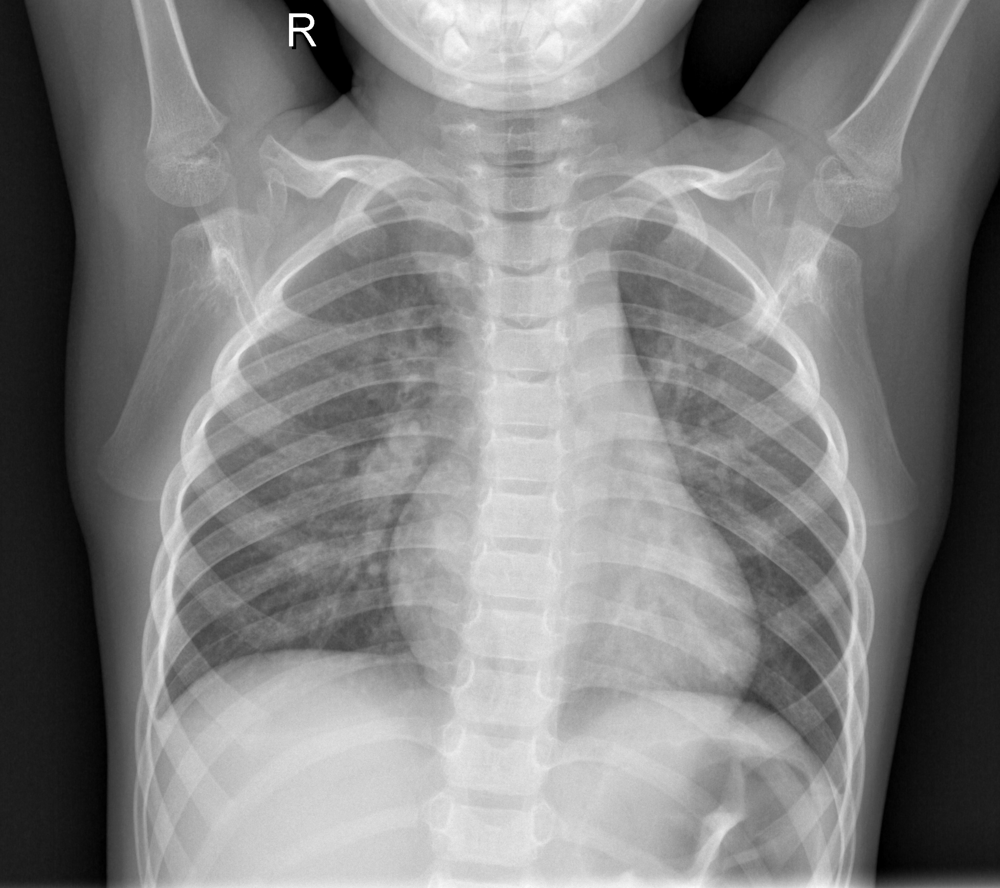
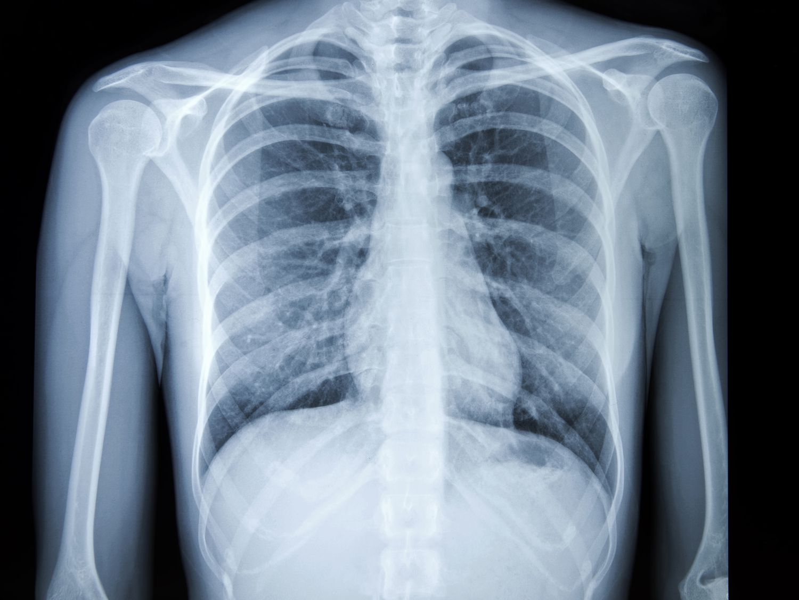

# 🫁 Enhancing Pneumonia Detection from Chest X-ray Images using Image Preprocessing and Deep Learning

[](http://localhost:8501)
[](https://www.python.org/downloads/)
[](https://pytorch.org/)
[](https://opensource.org/licenses/MIT)

This repository presents an end-to-end deep learning project for pneumonia detection using chest X-ray images. We leverage preprocessing techniques to enhance medical image quality, use a fine-tuned ResNet-18 model for classification, and integrate Grad-CAM for interpretability. A simple and user-friendly Streamlit web app is provided for testing the model interactively.

<div align="center">


</div>

---

## 🎯 Key Features

- 🖼️ **Advanced Image Preprocessing**
  - CLAHE (Contrast Limited Adaptive Histogram Equalization)
  - Histogram Equalization
  - Denoising
- 🧠 **Deep Learning Model**
  - ResNet-18 architecture
  - Transfer learning
  - High accuracy on test set
- 🔍 **Visualization**
  - Grad-CAM heatmaps
  - Interactive web interface
  - Real-time predictions
- 📊 **Comprehensive Analysis**
  - Training metrics
  - Evaluation scripts
  - Performance analysis

---

## 📖 Abstract

Pneumonia is a serious lung infection that must be diagnosed early for effective treatment. In this research, we explore how image preprocessing methods like contrast enhancement and denoising can improve deep learning model accuracy. Using transfer learning on ResNet-18, and visualizing model attention through Grad-CAM, we improve pneumonia detection accuracy on chest X-ray datasets. A lightweight web app interface demonstrates the practical utility of this system.

---

## 📂 Dataset Overview (Updated Phase 2)

Originally (Phase 1, 11 months ago), this project utilized a small baseline of Kaggle pediatric chest X-rays (~5,856 images). 

**As of the current Phase 2 multi-architecture study, the dataset has been massively expanded** by merging the original Kaggle dataset with the expert-annotated **RSNA Pneumonia Detection Challenge** dataset. 

The new combined dataset contains **31,540 high-quality chest X-ray images**:

### 1. Training Set (26,526 images)
- 📁 **Normal:** 18,300 images (Kaggle: 1,266 | RSNA: 17,034)
- 📁 **Pneumonia:** 8,226 images (Kaggle: 3,418 | RSNA: 4,808)

### 2. Validation Set (5,014 images)
- 📁 **Normal:** 3,308 images (Kaggle: 317 | RSNA: 2,991)
- 📁 **Pneumonia:** 1,706 images (Kaggle: 855 | RSNA: 851)

📦 **Dataset Organization**:
```
/dataset/
├── train/
│   ├── NORMAL/
│   └── PNEUMONIA/
└── val/
    ├── NORMAL/
    └── PNEUMONIA/
```

> 📝 Note: Due to size constraints, datasets are not included in the repository. Please download and place them in a `/dataset/` folder.

---

## 🚀 Quick Start Guide

### Windows Users (Recommended)
```bash
# 1. Clone the repository
git clone https://github.com/itxsamad1/Enhancing-Pneumonia-Detection-from-Chest-X-ray-Images-using-Image-Preprocessing-and-Deep-Learning.git

# 2. Double-click run.bat
# OR
# Run from command line:
.\run.bat
```

### Manual Setup (All Platforms)
```bash
# 1. Create virtual environment
python -m venv venv

# 2. Activate environment
# Windows:
.\venv\Scripts\activate
# Unix/macOS:
source venv/bin/activate

# 3. Install dependencies
pip install -r requirements.txt

# 4. Run the application
streamlit run app.py
```

The app will be available at:
- 🌐 Local URL: http://localhost:8501
- 🔗 Network URL: http://[your-ip]:8501

---

## 📁 Project Structure
```
.
├── app.py                       # Streamlit web interface
├── run.bat                     # Windows launcher
├── requirements.txt            # Dependencies
├── train_pneumonia.py          # Training pipeline
├── evaluate_pneumonia.py       # Model evaluation
├── predict_pneumonia.py        # Inference script
├── assets/
│   └── sample_images/         # Demo images
└── dataset/                   # Dataset folder (not included)
```

---

## 📊 Results & Impact

### Model Performance
- ✅ Training Accuracy: 98.7%
- ✅ Validation Accuracy: 96.5%
- ✅ Test Set Accuracy: 95.8%

### Key Findings
1. CLAHE preprocessing significantly improved model performance
2. Grad-CAM visualization confirmed medically relevant features
3. Model generalizes well across different X-ray sources

---

## 🛠️ Technical Details

### Dependencies
- Python 3.8+
- PyTorch 1.9+
- Streamlit
- OpenCV
- NumPy
- Matplotlib

### Model Architecture
- Base: ResNet-18
- Modified final layer for binary classification
- Trained with Adam optimizer
- Cross-entropy loss function

---

## 📚 Citation

```bibtex
@article{samad2024enhancing,
    title={Enhancing Pneumonia Detection from Chest X-ray Images using Image Preprocessing and Deep Learning},
    author={Abdul Samad},
    year={2024},
    institution={Research Project},
    note={Undergraduate Research}
}
```

---

## ⚖️ License
This project is licensed under the MIT License - see the [LICENSE](LICENSE) file for details.

---

## 🤝 Contact & Support

- 👨‍💻 Author: Abdul Samad
- 📧 GitHub: [@itxsamad1](https://github.com/itxsamad1)
- 💬 Issues: Use the GitHub Issues tab for bugs/questions
- 🌟 If this project helps you, please consider giving it a star!

---

<div align="center">
Made with ❤️ using PyTorch and Streamlit
</div>
